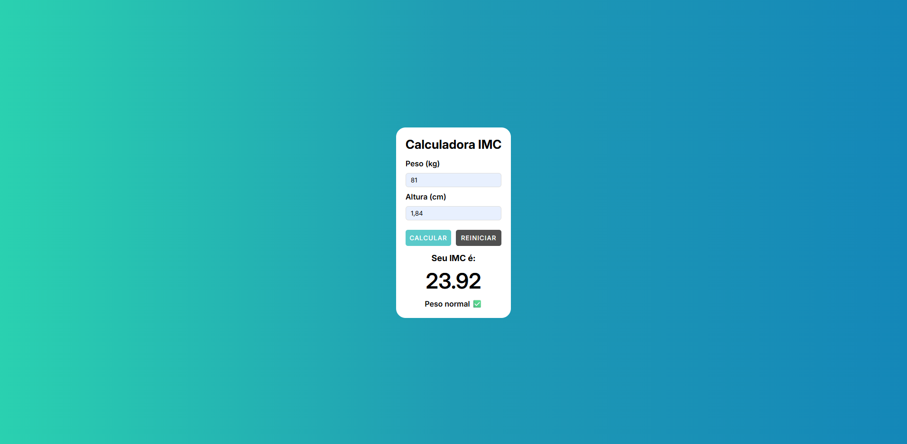

# 🧮 Calculadora de IMC

Este é um projeto simples de **Calculadora de IMC (Índice de Massa Corporal)** desenvolvido com **HTML**, **CSS** e **JavaScript puro**. A calculadora permite que o usuário insira seu peso e altura, e então retorna o valor do IMC junto com uma mensagem indicativa da faixa em que se encontra.

## 📸 Preview



## 🚀 Funcionalidades

- Inserção de **peso (kg)** e **altura (cm ou metros)**.
- Cálculo automático do **IMC** com validações de entrada.
- Classificação do IMC conforme os padrões da OMS.
- Botão para **reiniciar** os dados e limpar o resultado.

## 📋 Tabela de classificação do IMC

| IMC            | Classificação       |
| -------------- | ------------------- |
| Abaixo de 18.5 | Abaixo do peso      |
| 18.5 – 24.9    | Peso normal ✅      |
| 25.0 – 29.9    | Sobrepeso ⚠️        |
| 30.0 – 34.9    | Obesidade grau 1 ⚠️ |
| 35.0 – 39.9    | Obesidade grau 2 ⚠️ |
| 40.0 ou mais   | Obesidade grau 3 ❗ |

## 🧠 Tecnologias utilizadas

- **HTML5**
- **CSS3**
  - Reset personalizado
  - Responsividade simples
  - Estilização com Flexbox
- **JavaScript**
  - Manipulação de DOM
  - Validação de inputs
  - Lógica de cálculo

## 📁 Estrutura de pastas

```
calculadora-imc/
├── index.html
└── src/
    ├── css/
    │   ├── reset.css
    │   └── style.css
    ├── images/
    │   ├── preview.png
    └── js/
        └── script.js
```

## 🧪 Como usar

1. Clone o repositório:

   ```bash
   git clone https://github.com/seu-usuario/calculadora-imc.git
   ```

2. Acesse a pasta do projeto:

```bash
cd calculadora-imc
```

3. Abra o arquivo index.html no seu navegador.

## ✨ Melhorias futuras

- 🎯 Exibir faixa de IMC ideal com base na altura (ex: “Seu peso ideal está entre X kg e Y kg”).

- 📉 Gráfico ou barra de IMC mostrando onde o valor se encaixa (visualmente).

## 🤝 Contribuições

Sugestões, melhorias e feedbacks são bem-vindos! Sinta-se à vontade para abrir uma issue ou um pull request. 😊

## 🧑‍💻 Autor

Feito com 💙 por Endrius da Silva dos Santos